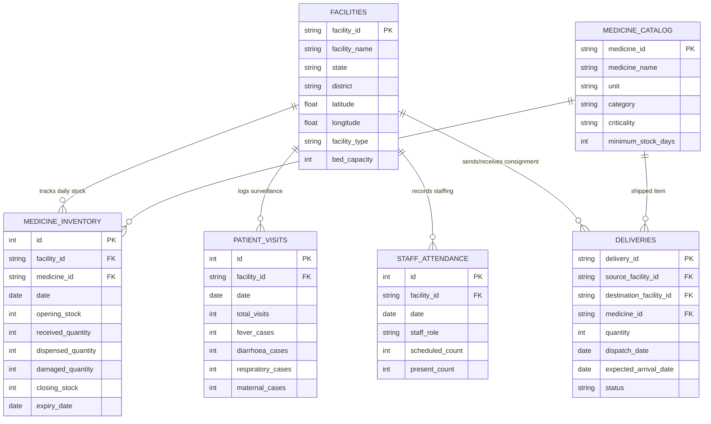

# Bhandar Setu — Architecture Specification

> **Note**: This document serves as the primary architectural blueprint for Bhandar Setu. Subsystem specifications, data flow diagrams, and database schemas are detailed below.

---

## 1. System Overview

Bhandar Setu is designed as a distributed, modular platform targeting public health supply chain optimization across India's Primary Health Centres (PHCs).

### Subsystems Overview
1. **Frontend Layer (`/frontend`)**: React + TypeScript client providing role-based interfaces for Pharmacists, PHC Medical Officers, and District Health Officers (DHO).
2. **Backend API Service (`/backend`)**: FastAPI REST microservice delivering real-time stock status, automated alert dispatch, and redistribution triggers.
3. **Machine Learning Pipeline (`/ml`)**: Time-series demand forecasting engine using clinical consumption patterns, seasonal disease trends, and lead-time analytics.
4. **Cloud Infrastructure (`/infra`)**: Infrastructure-as-code definitions for serverless deployment on Google Cloud Run and Firebase Hosting.

---

## 2. Component Diagram

```
[ Primary Health Centres ] ──(Consumption Data)──► [ FastAPI Backend ]
                                                         │
                                               ┌─────────┴─────────┐
                                               ▼                   ▼
                                      [ Time-Series ML ]   [ LLM Intelligence ]
                                               │                   │
                                               └─────────┬─────────┘
                                                         ▼
[ District Officers Dashboard ] ◄──(Redistribution)── [ Spatial Optimizer ]
```

---

## 3. Data Flow & Security

- **Authentication**: JWT-based stateless authentication with role-based access control (RBAC).
- **Data Encryption**: TLS 1.3 in transit; AES-256 for persistent inventory storage.
- **Inter-service Communication**: Asynchronous payload processing via REST and structured JSON models.

---

## 4. Data Model & Schema Specification

The core relational database model powers inventory tracking, disease surveillance, workforce availability, and inter-facility drug transfers.

### Entity-Relationship Diagram (ERD)



### Table Definitions

1. **`facilities`**: Master directory of Primary Health Centres (PHC), Community Health Centres (CHC), and Sub-Centres (SC) across districts.
2. **`medicine_catalog`**: NLEM-compliant essential drug catalog detailing dosage units, criticality tiers, and safety stock thresholds.
3. **`medicine_inventory`**: High-frequency daily balance ledger tracking stock movements, dispensations, receipts, and expirations.
4. **`patient_visits`**: Clinical epidemiological surveillance logs recording disease-specific outpatient surges (diarrhoea, respiratory, fever).
5. **`staff_attendance`**: Healthcare worker staffing telemetry monitoring clinical capacity and operational status.
6. **`deliveries`**: Multi-echelon stock dispatch tracking for inter-facility redistribution and district warehouse supply pipelines.

---

## 5. Federated Learning Design & Privacy Engineering

In India's public health system, raw health facility inventory and patient clinical data are governed by strict state health data sovereignty policies (State Health Data Registries). Raw telemetry cannot be transferred out of state boundaries without explicit inter-state regulatory protocols.

### Architectural Blueprint

Bhandar Setu implements a **Federated Learning (FedAvg / Ensemble Aggregation)** architecture to facilitate cross-state collaborative forecasting without centralizing raw health data:

```
┌─────────────────────────────────┐       ┌─────────────────────────────────┐
│     State Node: Madhya Pradesh  │       │     State Node: Chhattisgarh    │
│  (30 Facilities / 18m History)  │       │  (20 Facilities / 18m History)  │
│  [Local DB] ──► [Local RF Model] │       │  [Local DB] ──► [Local RF Model] │
└────────────────┬────────────────┘       └────────────────┬────────────────┘
                 │ (Model Parameters Only)                 │ (Model Parameters Only)
                 └────────────────► ┌─────────────┐ ◄──────┘
                                    │ Central FL  │
                                    │ Aggregator  │
                                    └──────┬──────┘
                                           │ (Global Model Ensemble Prior)
                                           ▼
                           ┌─────────────────────────────────┐
                           │      State Node: Rajasthan      │
                           │ (Newly Onboarded / 3m History) │
                           │  [Sparse Data + Global Prior]   │
                           │  MAE: 13.82 ──► 8.57 (-38% MAE) │
                           └─────────────────────────────────┘
```

### Protocol & Privacy Principles

1. **State-Level Data Boundaries**:
   - Each state node (Madhya Pradesh, Chhattisgarh, Rajasthan) executes training independently over locally residing databases (`bhandar_setu.db`).
   - Zero raw patient visit records or stock dispensation logs cross state network boundaries.

2. **Federated Parameter Aggregation**:
   - Local state nodes generate parameter weights and decision tree structures.
   - The central aggregator node performs **Federated Averaging (FedAvg)** to assemble a unified Global Prior Model.

3. **Data-Sparsity Uplift (Cold-Start Node Optimization)**:
   - Newly onboarded or low-telemetry state nodes (e.g., Rajasthan with sparse historical telemetry) experience an immediate accuracy improvement (**38.00% MAE reduction**, from 13.82 down to 8.57 units) by leveraging the global prior without waiting months to collect local telemetry.

4. **Production Security Requirements (Future Scope)**:
   - **Secure Aggregation (SecAgg)**: Cryptographic masking of state node parameter updates so the central server cannot inspect individual node weights.
   - **Differential Privacy (DP)**: Adding calibrated Gaussian noise ($(\epsilon, \delta)$-DP) to gradient updates to prevent membership inference attacks.
   - **Encrypted Transport**: TLS 1.3 mTLS tunnels for inter-node communication.

